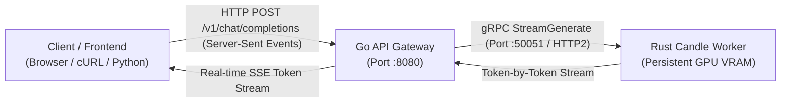

# Gemma 4 Production Architecture: Go API Gateway + Rust gRPC Inference Worker

[](https://www.rust-lang.org/)
[](https://golang.org/)
[](https://grpc.io/)
[-blue.svg)](https://github.com/huggingface/candle)
[-purple.svg)](https://huggingface.co/google)

A production-grade, multi-tier streaming inference system for **Google's Gemma 4** foundation model featuring:
* **Standalone Interactive CLI (`src/bin/cli.rs`):** Single-shot prompt inference directly from the terminal without networking overhead.
* **Rust Inference Worker (`src/main.rs`):** Persistent, long-running gRPC microservice built on **Tokio**, **Tonic**, and **Candle**. Keeps the Gemma 4 neural network warm in GPU memory (Apple Metal or NVIDIA CUDA) with zero initialization latency per request.
* **Multimodal Engine (`src/vision.rs`, `src/multimodal.rs`):** 16-layer Vision Transformer (ViT), 16x16 patch embedder, and projection head mapping visual tokens into the language model embedding space.
* **Go API Gateway (`go-gateway/`):** High-concurrency HTTP web server handling client traffic, managing connection lifecycles, and streaming tokens over Server-Sent Events (SSE).
* **Shared Interface (`proto/inference.proto`):** Type-safe bidirectional gRPC streaming contract.

## Word Hunt Arena

Launch 24–100 concurrent in-memory Word Hunt games and watch each solver swipe
the board live. The arena includes aggregate throughput/latency stats and a
final AI-player leaderboard, and runs without model credentials by default.

```bash
make arena
# open http://localhost:8787/

# Or build the same one-port container used for Cloud Run:
docker compose up --build
```

See [`hack/arena-deploy.md`](hack/arena-deploy.md) for configuration and
Cloud Run build steps.

---

## System Architecture



---

## Performance Matrix

| Metric | Apple Silicon M-Series (Metal FP16) | Nebius Cloud NVIDIA H100 80GB SXM5 (CUDA FP16) |
| :--- | :--- | :--- |
| **Model Boot / Warm-Up Time** | ~1.5 - 2.0 s (one-time) | **1.56 s** (one-time) |
| **Per-Request Init Overhead** | **0.00 ms** (Warm GPU VRAM) | **0.00 ms** (Warm GPU VRAM) |
| **Token Streaming Latency** | Instant first-token SSE | Instant first-token SSE |
| **Inference Speed** | ~4 - 6 tokens/sec | **30 - 43+ tokens/sec** |
| **Transport Protocol** | Low-latency binary gRPC | Low-latency binary gRPC |

---

## Prerequisites and Installation

### 1. System Requirements
- **Rust toolchain:** 1.80+ (`rustup default stable`)
- **Go toolchain:** 1.22+ (`brew install go` or `sudo apt install golang-go`)
- **Protobuf Compiler:** `protoc` (`brew install protobuf` or `sudo apt install protobuf-compiler`)
- **CUDA Toolkit (Linux Only):** CUDA 12.0+ with `nvcc` in `PATH`

### 2. Model Weights
Place the Google Gemma 4 model files in `models/gemma-4-e2b/`:
```
models/gemma-4-e2b/
├── config.json
├── tokenizer.json
└── model.safetensors
```

---

## Instructions and How to Run

### Option A: Standalone Single-Shot CLI Engine
Use this mode to test inference quickly directly from the terminal without launching network servers.

```bash
# On Apple Silicon (macOS Metal):
cargo run --bin cli --release "Explain zero-cost abstractions in Rust."

# On Linux (NVIDIA CUDA):
export PATH="/usr/local/cuda/bin:$PATH"
cargo run --bin cli --release --no-default-features --features cuda "Explain zero-cost abstractions in Rust."
```

---

### Option B: Scaled Production Architecture (Go Gateway + Rust gRPC Worker)

#### Step 1: Start the Rust gRPC Inference Worker (Terminal 1)
```bash
# On Apple Silicon (macOS Metal):
cargo run --release

# On Linux / Cloud GPU (NVIDIA CUDA):
export PATH="/usr/local/cuda/bin:$PATH"
export CUDA_HOME="/usr/local/cuda"
cargo run --release --no-default-features --features cuda
```
*The worker loads weights into GPU VRAM once at startup and listens on `0.0.0.0:50051`.*

#### Step 2: Start the Go API Gateway (Terminal 2)
```bash
cd go-gateway
go run main.go
```
*The gateway connects to the Rust worker and exposes an HTTP Server-Sent Events (SSE) endpoint on `http://0.0.0.0:8080`.*

#### Step 3: Stream Inference via cURL (Terminal 3)
```bash
curl -N -X POST http://localhost:8080/v1/chat/completions \
  -H "Content-Type: application/json" \
  -d '{
    "prompt": "Why are Rust and Go a great combination for AI infrastructure?",
    "max_tokens": 100,
    "temperature": 0.7
  }'
```

#### Example Server-Sent Events (SSE) Stream:
```json
data: {"token":"Rust","is_final":false}
data: {"token":" and","is_final":false}
data: {"token":" Go","is_final":false}
data: {"token":" complement","is_final":false}
data: {"token":" each","is_final":false}
data: {"token":" other","is_final":false}
data: {"token":" perfectly:","is_final":false}
data: {"token":" Go","is_final":false}
data: {"token":" delivers","is_final":false}
data: {"token":" rapid","is_final":false}
data: {"token":" concurrent","is_final":false}
data: {"token":" networking,","is_final":false}
data: {"token":" while","is_final":false}
data: {"token":" Rust","is_final":false}
data: {"token":" provides","is_final":false}
data: {"token":" zero-overhead","is_final":false}
data: {"token":" GPU","is_final":false}
data: {"token":" tensor","is_final":false}
data: {"token":" compute.","is_final":false}
data: [DONE]
```

---

### Option C: Multimodal Vision & Video CLI Engine

#### Running with an Image:
```bash
# On Apple Silicon (macOS Metal FP16):
cargo run --bin multimodal_cli --release -- photo.jpg "Describe what is depicted in this visual scene."

# On Linux (NVIDIA CUDA FP16):
export PATH="/usr/local/cuda/bin:$PATH"
cargo run --bin multimodal_cli --release --no-default-features --features cuda -- photo.png "Analyze the visual features."
```

#### Running with a Video:
```bash
# On Apple Silicon (macOS Metal FP16):
cargo run --bin multimodal_cli --release -- clip.mp4 "Summarize the key events in this video."

# On Linux (NVIDIA CUDA FP16):
export PATH="/usr/local/cuda/bin:$PATH"
cargo run --bin multimodal_cli --release --no-default-features --features cuda -- action.mov "What happens throughout this clip?"
```

---

## Multi-Cloud Deployment via SkyPilot (GCP + Nebius)

SkyPilot is configured as the standard orchestrator for all setup, execution, and teardown across **Google Cloud Platform (GCP)** and **Nebius Cloud**.

See [`SKYPILOT_GUIDE.md`](SKYPILOT_GUIDE.md) and [`docs/guides/GCP_SETUP.md`](docs/guides/GCP_SETUP.md) for full documentation.

### 1. Launch on Google Cloud (L4 / A100 / T4):
```bash
sky launch -c gemma4-gcp sky-gcp.yaml --yes
```

### 2. Launch on Nebius Cloud (H100 / L4):
```bash
sky launch -c gemma4-nebius sky-nebius.yaml --yes
```

### 3. Check Status and Monitor:
```bash
sky status
sky logs gemma4-gcp
```

### 4. Mandatory Teardown:
```bash
sky down gemma4-gcp --yes
# or teardown all clusters:
sky down --all --yes
```

---

## Protocol Buffer Contract (`proto/inference.proto`)

```protobuf
syntax = "proto3";

package inference;

service InferenceService {
  rpc StreamGenerate(GenerateRequest) returns (stream GenerateResponse);
}

message GenerateRequest {
  string prompt = 1;
  int32 max_tokens = 2;
  float temperature = 3;
}

message GenerateResponse {
  string token = 1;
  bool is_final = 2;
}
```

---

## Gemma 4 Architectural Novelties Inside `src/gemma4.rs`

1. **Per-Layer Embeddings (PLE):** Injects a 256-dimensional token identity + context projection dynamically at every layer:
   $$\text{PLE}_l = \text{Norm}\left(\text{Proj}(x) \cdot \frac{1}{\sqrt{d_{\text{model}}}} + \text{Embed}_{\text{PLE}}(w) \cdot \sqrt{d_{\text{ple}}}\right) \cdot \frac{1}{\sqrt{2}}$$
2. **Upper-Layer KV-Sharing:** Layers 15..34 share the Key and Value cache from lower layers, reducing memory bandwidth pressure.
3. **Proportional RoPE:** Full-attention layers use `global_head_dim = 512` with `partial_rotary_factor = 0.25` (128 rotated channels, 384 pass-through).
4. **Quad-RMSNorm Blocks:** 4 RMSNorms per decoder layer + unit RMSNorm on Value vectors.

---

## Documentation and Deep-Dives

Complete architectural guides and systems deep-dives are located in [`docs/`](docs/):
- **[Top 10 Rust Concepts in this Project](docs/RUST_CONCEPTS.md)**
- **[Top 10 Go Concepts in this Project](docs/GO_CONCEPTS.md)**
- **[Neural Architecture & Deep Learning Internals](docs/NEURAL_ARCHITECTURE_INTERNALS.md)**
- **[Multimodal Vision & Audio Architecture](docs/MULTIMODAL_ARCHITECTURE.md)**
- **[GCP Deployment Guide](docs/guides/GCP_SETUP.md)**
- **[Nebius Deployment Guide](docs/guides/NEBIUS_SETUP.md)**

---

## Repository Layout

```
.
├── Cargo.toml                  # Rust manifest with Candle, Tokio, Tonic, Prost
├── build.rs                    # Tonic-build compiling proto/inference.proto
├── proto/
│   └── inference.proto         # gRPC streaming service definition
├── go-gateway/
│   ├── go.mod                  # Go module definition
│   ├── main.go                 # HTTP/2 SSE API Gateway + gRPC Client
│   └── proto/                  # Generated Go protobuf stubs
├── src/
│   ├── lib.rs                  # Library root exposing gemma4, vision, and multimodal modules
│   ├── main.rs                 # Persistent gRPC inference worker & server
│   ├── gemma4.rs               # Pure Rust implementation of Gemma 4
│   ├── vision.rs               # Vision Transformer (ViT) & Patch Embedder
│   ├── multimodal.rs           # Multimodal conditional generation engine
│   └── bin/
│       ├── cli.rs              # Standalone single-shot text CLI
│       └── multimodal_cli.rs   # Standalone multimodal vision CLI
├── docs/
│   ├── README.md               # Master documentation index
│   ├── RUST_CONCEPTS.md        # Rust systems patterns
│   ├── GO_CONCEPTS.md          # Go concurrency patterns
│   ├── NEURAL_ARCHITECTURE_INTERNALS.md # Transformer mathematical breakdown
│   ├── MULTIMODAL_ARCHITECTURE.md       # Vision-language pipeline
│   └── guides/
│       ├── GCP_SETUP.md        # Google Cloud Platform guide
│       └── NEBIUS_SETUP.md     # Nebius Cloud guide
├── models/
│   └── gemma-4-e2b/            # Model weights (Safetensors), tokenizer.json, config.json
├── BUILDERS_LOG.md             # Detailed engineering troubleshooting log
├── SKYPILOT_GUIDE.md           # SkyPilot multi-cloud orchestrator guide
├── SLIDES.html                 # Presentation slide deck
├── SLIDES.md                   # Presentation slide source
└── README.md                   # System architecture documentation
```

---

## License
Apache-2.0 / MIT.
Gemma 4 model weights are subject to Google's Gemma Terms of Use.
