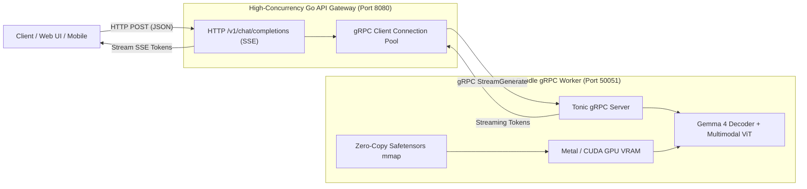

# Module 0: Welcome to Oxidizing Gemma

Welcome to the **Oxidizing Gemma Workshop**! In this codelab, you will learn how to build, optimize, and deploy a native LLM and multimodal vision inference engine from first principles.

---

## 1. The Mission

Most modern machine learning infrastructure relies heavily on Python. While Python is great for rapid experimentation and model training, it introduces significant friction in high-throughput, low-latency production serving:

* **Massive Docker Images:** 15GB+ images containing Python runtimes, CUDA wheels, PyTorch, and dynamic dependencies.
* **Garbage Collection Jitter:** Non-deterministic GC pauses that cause high tail latencies ($p99$) during real-time token streaming.
* **The Global Interpreter Lock (GIL):** Difficult concurrency and expensive inter-process communication (IPC) for handling thousands of concurrent client requests.

**Your Goal:** Build a zero-Python runtime where:
1. **The Core Inference Worker is Pure Rust (Candle):** 35MB standalone binary with direct zero-copy memory mapping (`mmap`) of Safetensors weights into GPU/Metal VRAM.
2. **The API Gateway is Pure Go:** Lightweight HTTP reverse proxy delivering OpenAI-compatible Server-Sent Events (SSE) streaming with low CPU and memory footprints.
3. **The Communication Layer is gRPC / Protocol Buffers:** Strongly-typed, sub-millisecond IPC streaming tokens directly from the neural decoder loop.
4. **The Vision Engine is Multimodal:** Supports both static images and temporal multi-frame video inputs through a 16-layer Vision Transformer (ViT).



---

## 2. The Prompting Paradox

As an engineer in the age of AI coding assistants, you may ask:
> *"Why not just prompt an AI in English to write everything?"*

Consider what happens when trying to prompt an architectural requirement:

* **Verbose English Prompt (110+ words):**
  > *"Take the query vectors, scale them by the inverse square root of head dimension, compute pairwise dot-products against all key vectors across the sequence length, apply numerical stabilization by subtracting row maximums, compute softmax across the attention window, and multiply by the value representations..."*
* **Baked-In Domain Knowledge & Code:**
  $$\text{Attention}(Q, K, V) = \text{Softmax}\left(\frac{Q K^T}{\sqrt{d_k}}\right)V$$
  ```rust
  let scores = (q.matmul(&k.t())? * (1.0 / sqrt_d))?;
  let weights = candle_nn::ops::softmax(&scores, 1)?;
  let context = weights.matmul(&v)?;
  ```

### Key Takeaway
You cannot prompt an AI agent for architectural concepts that you do not have a mental model for. Learning systems programming in Rust and Go gives you the mental primitives—*memory layout, zero-copy pointer semantics, ownership, and cache coherence*—needed to architect state-of-the-art AI infrastructure.

---

## 3. Workshop Prerequisites

Ensure you have the following installed on your machine or cloud VM:
* **Rust Toolchain:** `rustc 1.75+` and `cargo` (`curl --proto '=https' --tlsv1.2 -sSf https://sh.rustup.rs | sh`)
* **Go Toolchain:** `go 1.22+` (`https://go.dev/dl/`)
* **Protocol Buffers Compiler:** `protoc` (`brew install protobuf` on macOS, `apt-get install -y protobuf-compiler` on Linux)
* **FFmpeg (Optional for Video Processing):** `ffmpeg` (`brew install ffmpeg` on macOS, `apt-get install -y ffmpeg` on Linux)

Let's begin! Move on to **[Module 1: Toolchain Setup & Zero-Copy Weight Memory-Mapping](./01-environment-and-weights.md)**.
