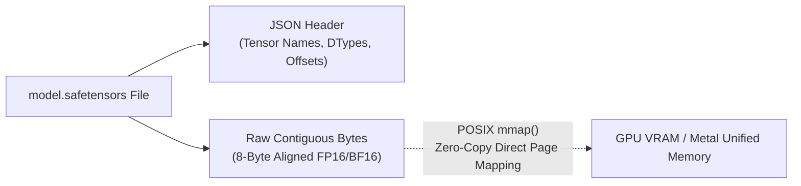

# Module 1: Toolchain Setup & Zero-Copy Weight Memory-Mapping

In this module, you will set up the project environment, download the Google Gemma 4 model weights, and explore how **Safetensors** and **POSIX memory-mapping (`mmap`)** eliminate weight deserialization overhead.

---

## 1. Project Dependencies & Configuration

Open [`Cargo.toml`](../Cargo.toml) to examine the dependency graph:

```toml
[package]
name = "gemma_hello"
version = "0.1.0"
edition = "2021"

[features]
default = ["metal"]
metal = ["candle-core/metal", "candle-nn/metal", "candle-transformers/metal"]
cuda = ["candle-core/cuda", "candle-nn/cuda", "candle-transformers/cuda"]

[dependencies]
candle-core = { version = "0.8" }
candle-nn = { version = "0.8" }
candle-transformers = { version = "0.8" }
hf-hub = "0.3"
tokenizers = "0.20"
serde = { version = "1.0", features = ["derive"] }
serde_json = "1.0"
anyhow = "1.0"
dotenvy = "0.15"
tokio = { version = "1", features = ["full"] }
tokio-stream = "0.1"
tonic = "0.12"
prost = "0.13"
image = "0.25"

[build-dependencies]
tonic-build = "0.12"
```

---

## 2. Downloading Gemma 4 Model Weights

Gemma 4 weights and tokenizers are hosted on Hugging Face Hub under `google/gemma-4-e2b`.

```bash
# 1. Create the destination directory
mkdir -p models/gemma-4-e2b

# 2. Download configuration and tokenizer files
curl -L -o models/gemma-4-e2b/config.json https://huggingface.co/google/gemma-4-e2b/raw/main/config.json
curl -L -o models/gemma-4-e2b/tokenizer.json https://huggingface.co/google/gemma-4-e2b/raw/main/tokenizer.json

# 3. Download the Safetensors weight shard (requires Hugging Face Token if gated)
# Using python/huggingface-cli or curl:
# huggingface-cli download google/gemma-4-e2b model.safetensors --local-dir models/gemma-4-e2b
```

---

## 3. Safetensors vs. Legacy PyTorch Pickles

Legacy ML frameworks use Python's `pickle` format (`.bin`, `.pt`, `.pth`). Pickling executes arbitrary Python bytecode on load, presenting security risks and forcing full deserialization into host RAM before copying to GPU memory.

**Safetensors** solves this with a binary format:
1. **JSON Header:** Contains tensor names, shapes, datatypes, and exact byte offsets within the file.
2. **Contiguous Binary Payload:** Raw, uncompressed, 8-byte aligned tensor bytes.



---

## 4. Hands-On: Zero-Copy Weight Loading in Rust

In Rust, we scan all `.safetensors` files in the directory and create a `VarBuilder` using `unsafe { VarBuilder::from_mmaped_safetensors(...) }`:

```rust
use anyhow::Result;
use candle_core::{DType, Device};
use candle_nn::VarBuilder;
use std::path::{Path, PathBuf};

fn get_safetensors_files<P: AsRef<Path>>(dir: P) -> Result<Vec<PathBuf>> {
    let mut files = Vec::new();
    for entry in std::fs::read_dir(dir)? {
        let entry = entry?;
        let path = entry.path();
        if path.is_file() && path.extension().and_then(|s| s.to_str()) == Some("safetensors") {
            files.push(path);
        }
    }
    files.sort();
    if files.is_empty() {
        anyhow::bail!("No .safetensors files found in the specified model directory");
    }
    Ok(files)
}

fn load_model_weights(model_dir: &Path, device: &Device, dtype: DType) -> Result<VarBuilder> {
    let weight_files = get_safetensors_files(model_dir)?;
    println!("Mapping {} weight shard(s)...", weight_files.len());
    
    // Safety: The safetensors file must not be modified externally while mapped.
    let vb = unsafe {
        VarBuilder::from_mmaped_safetensors(&weight_files, dtype, device)?
    };
    
    Ok(vb)
}
```

### Why `unsafe`?
`VarBuilder::from_mmaped_safetensors` is marked `unsafe` because memory-mapping exposes raw virtual memory. If another process truncates or modifies the underlying `.safetensors` file while the model is executing, a page fault or undefined behavior could occur. Rust forces you to explicitly acknowledge this operational invariant.

---

## Checkpoint

Run the standalone CLI test binary to verify weight loading on your machine:

```bash
# On Apple Silicon (Metal):
cargo run --bin cli --release -- "Hello Gemma!"

# On Linux (NVIDIA CUDA):
cargo run --bin cli --release --no-default-features --features cuda -- "Hello Gemma!"
```

Next, let's explore the neural architecture in **[Module 2: Gemma 4 Decoder & Per-Layer Embeddings (PLE)](./02-architecture-and-per-layer-embeddings.md)**.
