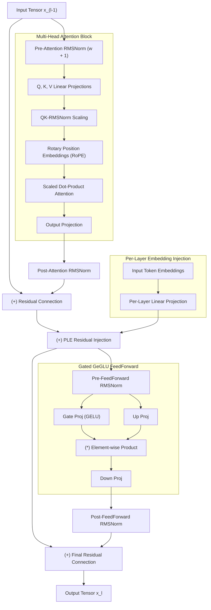

# Module 2: Gemma 4 Decoder & Per-Layer Embeddings (PLE)

In this module, you will dive into the low-level neural mechanics of **Google Gemma 4**. You will implement **RMSNorm (+1 unit scaling)**, **RoPE rotary position embeddings**, **GeGLU MLPs**, and the architectural innovation known as **Per-Layer Embeddings (PLE)**.

---

## 1. Gemma 4 Decoder Anatomy

Unlike standard LLaMA-style decoders, Gemma 4 introduces several specialized modifications:
1. **Embedding Multiplier:** Input embeddings are scaled by $\sqrt{d_{\text{model}}} = \sqrt{1536} \approx 39.1918$.
2. **RMSNorm with Unit Scaling:** Normalization weights are centered around $1.0$ (i.e. $x \cdot (w + 1)$).
3. **Query/Key RMSNorm:** Independent normalization applied to $Q$ and $K$ vectors prior to RoPE to prevent attention logit drift.
4. **Per-Layer Embeddings (PLE):** Direct projection from initial token embeddings into intermediate decoder layers.



---

## 2. Implementing Gemma 4 RMSNorm with Unit Offset

Standard RMSNorm computes:
$$\text{RMSNorm}(x) = \frac{x}{\sqrt{\frac{1}{d} \sum_{i=1}^d x_i^2 + \epsilon}} \odot \gamma$$

In Gemma 4, $\gamma$ is initialized to zeros and interpreted as a residual offset:
$$\text{Gemma4RMSNorm}(x) = \frac{x}{\sqrt{\frac{1}{d} \sum_{i=1}^d x_i^2 + \epsilon}} \odot (\gamma + 1.0)$$

Here is the exact Rust implementation from [`src/gemma4.rs`](../src/gemma4.rs#L34-L52):

```rust
use candle_core::{Result, Tensor};
use candle_nn::VarBuilder;

#[derive(Clone, Debug)]
pub struct Gemma4RMSNorm {
    weight: Tensor,
    eps: f64,
}

impl Gemma4RMSNorm {
    pub fn new(dim: usize, eps: f64, vb: VarBuilder) -> Result<Self> {
        let weight = vb.get(dim, "weight")?;
        Ok(Self { weight, eps })
    }

    pub fn forward(&self, x: &Tensor) -> Result<Tensor> {
        let x_dtype = x.dtype();
        let internal_x = x.to_dtype(candle_core::DType::F32)?;
        let variance = internal_x.sqr()?.mean_keepdim(candle_core::D::Minus1)?;
        let x_normed = internal_x.broadcast_div(&(variance + self.eps)?.sqrt()?)?;
        
        // Scale with unit offset: x_normed * (weight + 1.0)
        let weight_f32 = self.weight.to_dtype(candle_core::DType::F32)?;
        let scale = (weight_f32 + 1.0)?;
        x_normed.broadcast_mul(&scale)?.to_dtype(x_dtype)
    }
}
```

---

## 3. What is Per-Layer Embedding (PLE)?

In standard Transformers, token embeddings are only ingested at Layer 0. As tokens travel through 30+ transformer layers, initial semantic features can degrade or suffer from gradient vanishing during training.

Gemma 4 resolves this by maintaining a direct projection from the **initial embedding table** into every decoder layer:

```rust
// In src/gemma4.rs:
// If the layer defines a per_layer_projection weight:
if let Some(ref ple) = self.per_layer_projection {
    let ple_features = ple.forward(initial_embeddings)?;
    hidden_states = (hidden_states + ple_features)?;
}
```

### Benefits of PLE:
* **Direct Gradient Highway:** Injects raw lexical information directly into deep reasoning layers.
* **Preserved Token Identity:** Prevents long-context generation from drifting away from key conditioning tokens.

---

## Checkpoint

Review [`src/gemma4.rs`](../src/gemma4.rs) to verify how `Gemma4RMSNorm` and `Gemma4DecoderLayer` are integrated.

Next, let's explore KV caching and memory sharing in **[Module 3: Upper-Layer KV Cache Sharing & Memory Arithmetic](./03-kv-cache-and-upper-layer-sharing.md)**.
