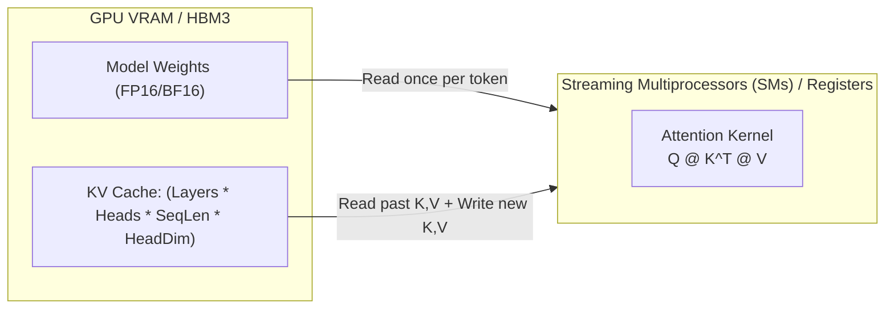
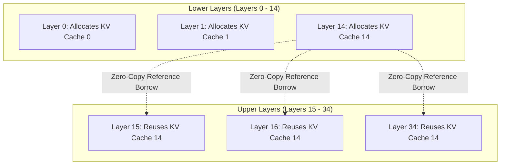

# Module 3: Upper-Layer KV Cache Sharing & Memory Arithmetic

In this module, you will analyze why foundation models are **memory-bandwidth bound** during autoregressive generation, and how Gemma 4's **Upper-Layer KV-Cache Sharing** reduces VRAM consumption and inference memory bandwidth by up to **4x** in deep layers.

---

## 1. Why LLM Inference is Memory-Bound

During autoregressive token generation, the model predicts one token at a time:
* At step $t$, the computational cost is low (matrix-vector multiplication).
* However, all past Key and Value vectors for all prior tokens $0 \dots t-1$ across all layers must be loaded from GPU High Bandwidth Memory (HBM) into SRAM registers.



**The Bottleneck:** At large batch sizes and long context lengths (e.g., 32k tokens), the KV Cache can consume more memory than the model weights themselves!

---

## 2. Gemma 4 Innovation: Upper-Layer KV Sharing

In Gemma 4 (35 total decoder layers):
* **Lower Layers (0 through 14):** Each layer computes and caches its own independent Key and Value tensors.
* **Upper Layers (15 through 34):** Instead of allocating new $K$ and $V$ tensors, the upper layers **share and reuse** the Key and Value cache calculated by Layer 14!



---

## 3. The Math: VRAM Memory Savings

Let:
* $L = 35$ (total layers)
* $H_{\text{KV}} = 4$ (key-value heads)
* $D_{\text{head}} = 256$ (dimension per head)
* $S = 8192$ (context sequence length)
* Precision = 2 bytes (FP16 / BF16)

### Standard Transformer KV Cache Size:
$$\text{Memory}_{\text{Standard}} = 2 \times L \times H_{\text{KV}} \times D_{\text{head}} \times S \times \text{bytes}$$
$$\text{Memory}_{\text{Standard}} = 2 \times 35 \times 4 \times 256 \times 8192 \times 2 = 1.179 \text{ GB per sequence}$$

### Gemma 4 Upper-Layer Shared KV Cache Size:
$$\text{Effective Layers} = 15 \text{ (Layers 0..14)}$$
$$\text{Memory}_{\text{Gemma4}} = 2 \times 15 \times 4 \times 256 \times 8192 \times 2 = 0.505 \text{ GB per sequence}$$

**Result:** A **57.1% reduction in total KV cache memory**, allowing larger batch sizes and higher token throughput.

---

## 4. Rust Zero-Cost Borrowing for Shared KV

In Python, sharing state across layers often involves complex dictionary management or tensor slicing that can cause accidental memory copies. 

In Rust, Candle allows passing a shared `Option<(&Tensor, &Tensor)>` reference directly into the attention block without copying memory:

```rust
// In src/gemma4.rs:
pub fn forward(
    &mut self,
    x: &Tensor,
    pos: usize,
    shared_kv: Option<(&Tensor, &Tensor)>,
) -> Result<(Tensor, Option<(Tensor, Tensor)>)> {
    // If this layer is an upper shared layer, reuse the borrowed K, V references
    let (k, v) = match shared_kv {
        Some((shared_k, shared_v)) => (shared_k.clone(), shared_v.clone()),
        None => {
            // Compute fresh K, V and store in this layer's KV Cache
            let k = self.k_proj.forward(&normed_x)?;
            let v = self.v_proj.forward(&normed_x)?;
            self.update_kv_cache(&k, &v, pos)?
        }
    };
    
    // Perform attention using Q and (K, V)...
}
```

---

## Checkpoint

Test the token generation loop and observe memory stability during decoding:

```bash
cargo run --bin cli --release -- "Explain the difference between memory bandwidth and compute throughput."
```

Next, let's turn our inference engine into a streaming network service in **[Module 4: High-Throughput gRPC Streaming Engine](./04-high-throughput-grpc-engine.md)**.
