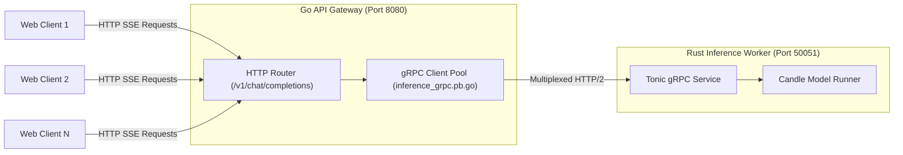

# Module 5: High-Concurrency Go API Gateway & SSE

In this module, you will build a high-concurrency **Go API Gateway** that connects to your Rust gRPC inference worker and exposes an OpenAI-compatible **Server-Sent Events (SSE)** endpoint at `POST /v1/chat/completions`.

---

## 1. Why Go for the API Gateway?

While Rust excels at raw compute and fine-grained tensor memory control, **Go** is the industry standard for cloud network proxies:
* **Lightweight Goroutines:** Go schedules tens of thousands of simultaneous HTTP connections on lightweight 2KB green threads.
* **Non-Blocking I/O:** Perfect for long-lived Server-Sent Event (SSE) and WebSocket streams.
* **Zero GC Pressure on Weights:** The Go gateway holds no model weights, leaving 100% of GPU VRAM for the Rust Candle worker.



---

## 2. Generating Go Protobuf Bindings

If you modify `proto/inference.proto`, regenerate the Go bindings:

```bash
cd go-gateway
protoc --go_out=. --go_opt=paths=source_relative \
       --go-grpc_out=. --go-grpc_opt=paths=source_relative \
       ../proto/inference.proto
cd ..
```

---

## 3. Implementing the SSE Streaming Handler

In [`go-gateway/main.go`](../go-gateway/main.go), we handle incoming client requests and stream tokens in OpenAI-compatible JSON chunks:

```go
func handleChatCompletions(w http.ResponseWriter, r *http.Request) {
    var req ChatRequest
    if err := json.NewDecoder(r.Body).Decode(&req); err != nil {
        http.Error(w, "Invalid JSON body", http.StatusBadRequest)
        return
    }

    // Set Server-Sent Events headers
    w.Header().Set("Content-Type", "text/event-stream")
    w.Header().Set("Cache-Control", "no-cache")
    w.Header().Set("Connection", "keep-alive")
    w.Header().Set("Access-Control-Allow-Origin", "*")

    flusher, ok := w.(http.Flusher)
    if !ok {
        http.Error(w, "Streaming unsupported", http.StatusInternalServerError)
        return
    }

    // Call Rust worker via gRPC
    stream, err := grpcClient.StreamGenerate(r.Context(), &pb.GenerateRequest{
        Prompt:      req.Prompt,
        MaxTokens:   int32(req.MaxTokens),
        Temperature: req.Temperature,
        TopP:        req.TopP,
    })
    if err != nil {
        http.Error(w, "gRPC stream failed", http.StatusBadGateway)
        return
    }

    for {
        resp, err := stream.Recv()
        if err == io.EOF || (resp != nil && resp.IsFinished) {
            fmt.Fprintf(w, "data: [DONE]\n\n")
            flusher.Flush()
            break
        }
        if err != nil {
            break
        }

        chunk := ChatCompletionChunk{
            ID:      "chatcmpl-gemma4",
            Object:  "chat.completion.chunk",
            Created: time.Now().Unix(),
            Choices: []ChunkChoice{
                {
                    Delta:        ChunkDelta{Content: resp.Text},
                    FinishReason: nil,
                },
            },
        }

        data, _ := json.Marshal(chunk)
        fmt.Fprintf(w, "data: %s\n\n", data)
        flusher.Flush()
    }
}
```

---

## 4. Running the Complete System

### Step 1: Start the Rust Worker
```bash
cargo run --release --bin gemma_hello
```

### Step 2: Start the Go Gateway
```bash
cd go-gateway
go run main.go
```

### Step 3: Test Real-Time Streaming via Curl or `stream.sh`
```bash
./stream.sh "Explain why Rust and Go complement each other in production systems."
```

---

## Checkpoint

You should see tokens streaming in real-time in your terminal!

Next, let's add vision and video support in **[Module 6: Multimodal Vision & Video Engine](./06-multimodal-vision-and-video.md)**.
