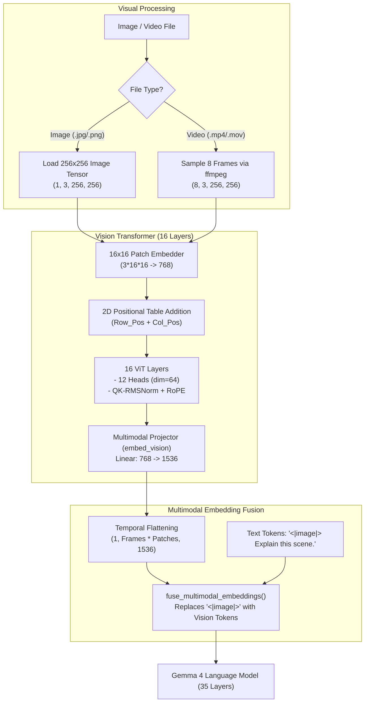

# Module 6: Multimodal Vision & Video Engine

In this module, you will explore the multimodal architecture of Gemma 4. You will implement a **16-layer Vision Transformer (ViT)**, **2D spatial position embedding tables**, **linear multimodal projection**, and a temporal video pipeline using **FFmpeg** and Candle.

---

## 1. Vision Architecture Overview

Gemma 4 processes images and video frames through a dedicated Vision Tower before projecting the resulting patch tokens into the language model's embedding space:



---

## 2. 2D Spatial Positional Table Lookup

Unlike 1D text RoPE, images have 2D spatial relationships $(y, x)$. Gemma 4 uses a heterogeneous positional table of shape `[2, 10240, 768]`:
* Row `0` stores row positional embeddings.
* Row `1` stores column positional embeddings.

```rust
// In src/vision.rs:
let row_pos = self.position_embedding_table.narrow(0, 0, 1)?.squeeze(0)?;
let col_pos = self.position_embedding_table.narrow(0, 1, 1)?.squeeze(0)?;

let mut pos_embeds = Vec::with_capacity(num_patches);
for row in 0..num_patches_h {
    for col in 0..num_patches_w {
        let r_emb = row_pos.narrow(0, row, 1)?;
        let c_emb = col_pos.narrow(0, col, 1)?;
        pos_embeds.push((r_emb + c_emb)?);
    }
}
let pos_tensor = Tensor::cat(&pos_embeds.iter().collect::<Vec<_>>(), 0)?;
let pos_tensor = pos_tensor.unsqueeze(0)?.to_dtype(patch_embeddings.dtype())?;

// Broadcast add positional embedding across all video frames
patch_embeddings.broadcast_add(&pos_tensor)?
```

---

## 3. Video Frame Temporal Concatenation

When processing a video, $N$ frames (e.g. 8 keyframes) are sampled across time. Each frame produces $256$ patches of dimension $1536$. 

In [`src/multimodal.rs`](../src/multimodal.rs#L88-L103), all temporal frames are flattened into a continuous visual token stream:

$$\text{Shape: } (8, 256, 1536) \xrightarrow{\text{reshape}} (1, 2048, 1536)$$

The language model's attention mechanism attends across all temporal visual tokens, understanding motion, scene transitions, and visual events over time.

---

## 4. Running Image and Video Inference

### Running on an Image:
```bash
# On Apple Silicon:
cargo run --bin multimodal_cli --release -- photo.jpg "Describe what is depicted in this visual scene."

# On NVIDIA CUDA:
cargo run --bin multimodal_cli --release --no-default-features --features cuda -- photo.png "Analyze the visual features."
```

### Running on a Video:
```bash
# On Apple Silicon:
cargo run --bin multimodal_cli --release -- clip.mp4 "Summarize the key events in this video."

# On NVIDIA CUDA:
cargo run --bin multimodal_cli --release --no-default-features --features cuda -- action.mov "What happens throughout this clip?"
```

---

## Checkpoint

Test your multimodal CLI with an image or video file and verify token generation.

Next, let's deploy our system across cloud GPUs in **[Module 7: Multi-Cloud Deployment & Hardware Benchmarking](./07-cloud-orchestration-skypilot.md)**.
