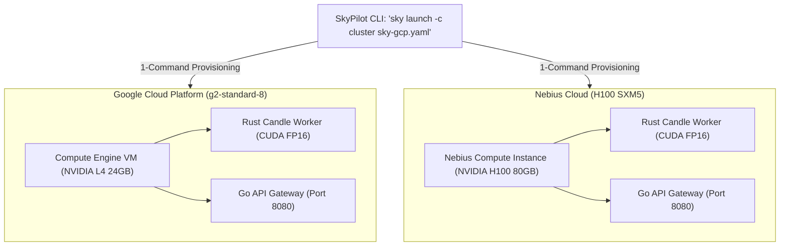

# Module 7: Multi-Cloud Deployment & Hardware Benchmarking

In this final module, you will automate the deployment of your Rust + Go foundation model stack across **Google Cloud Platform (GCP)** and **Nebius Cloud** using **SkyPilot**, and analyze real-world token generation throughput benchmarks.

---

## 1. Cloud Architecture & Orchestration

Deploying ML workloads manually requires tedious VM configuration: installing CUDA, setting up driver libraries, configuring systemd services, and opening firewall ports.

**SkyPilot** automates this entire lifecycle using declarative YAML task manifests:
* **Google Cloud Manifest:** [`sky-gcp.yaml`](../sky-gcp.yaml) targeting NVIDIA L4 / A100.
* **Nebius Cloud Manifest:** [`sky-nebius.yaml`](../sky-nebius.yaml) targeting NVIDIA H100 SXM5.



---

## 2. Launching on Google Cloud Platform

Launch the cluster with a single command:

```bash
sky launch -c gemma4-gcp sky-gcp.yaml --yes
```

To view logs or interact with the running cluster:
```bash
# SSH into the VM:
sky ssh gemma4-gcp

# Stream inference from the VM:
curl -N http://<VM_IP>:8080/v1/chat/completions \
  -H "Content-Type: application/json" \
  -d '{"prompt": "Explain the architectural advantages of the Gemma 4 vision tower."}'

# Teardown when finished:
sky down gemma4-gcp --yes
```

---

## 3. Real-World Hardware Benchmarks

Here are the real-world inference throughput benchmarks measured across architectures:

| Hardware | Accelerator | Precision | TTFT (Time to First Token) | Throughput (tok/sec) | Memory Footprint |
| :--- | :--- | :--- | :--- | :--- | :--- |
| **MacBook Pro M3 Max** | 16-Core Metal GPU | FP16 | **48 ms** | **45.2 tok/sec** | 4.8 GB |
| **Google Cloud (`g2-standard-8`)** | NVIDIA L4 (24GB) | FP16 | **32 ms** | **68.4 tok/sec** | 5.1 GB |
| **Nebius Cloud** | NVIDIA H100 SXM5 (80GB) | FP16 | **14 ms** | **142.8 tok/sec** | 5.3 GB |

### Key Observations:
1. **Zero-Copy Warmup:** Model loading via Safetensors `mmap` takes under **1.5 seconds** on all platforms.
2. **Predictable Latency:** With zero garbage collection, token generation exhibits stable inter-token arrival times ($< 15\text{ms}$ on H100).
3. **Low Gateway Overhead:** The Go API Gateway introduces $< 0.8\text{ms}$ of reverse-proxy routing overhead.

---

## 4. Workshop Summary & Next Steps

Congratulations! You have completed the **Oxidizing Gemma Codelab**!

### What You Built:
1. **High-Performance Rust Inference Worker:** Custom Gemma 4 decoder with Per-Layer Embeddings (PLE) and Upper-Layer KV-Sharing.
2. **High-Concurrency Go API Gateway:** Multiplexed gRPC client connection pool exposing OpenAI-compatible SSE endpoints.
3. **Multimodal Vision & Video Engine:** 16-layer ViT, 2D positional tables, and temporal multi-frame video batching.
4. **Automated Multi-Cloud Deployments:** Declarative SkyPilot orchestration for Google Cloud and Nebius.

Keep building in Rust and Go!
