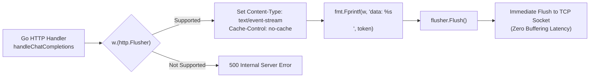
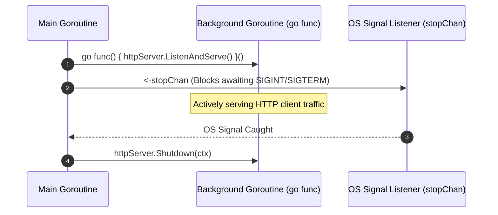
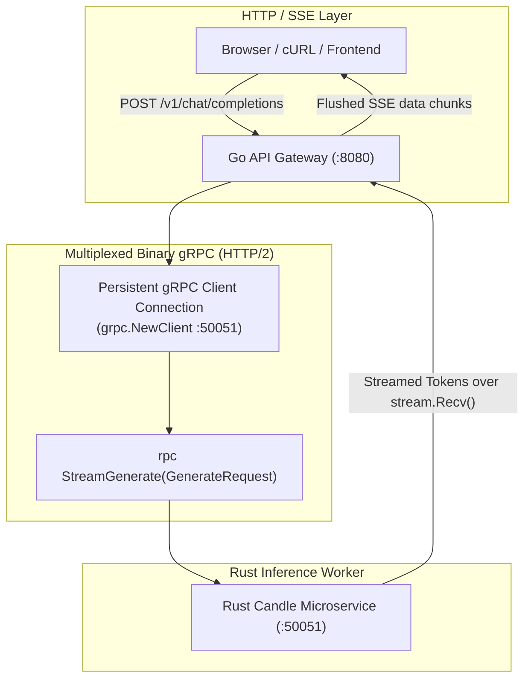
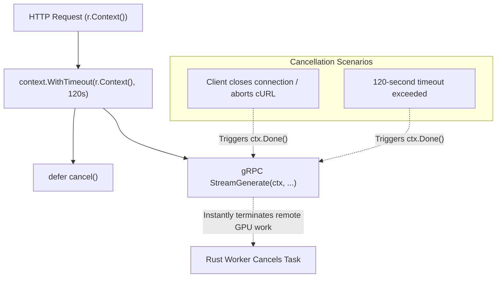
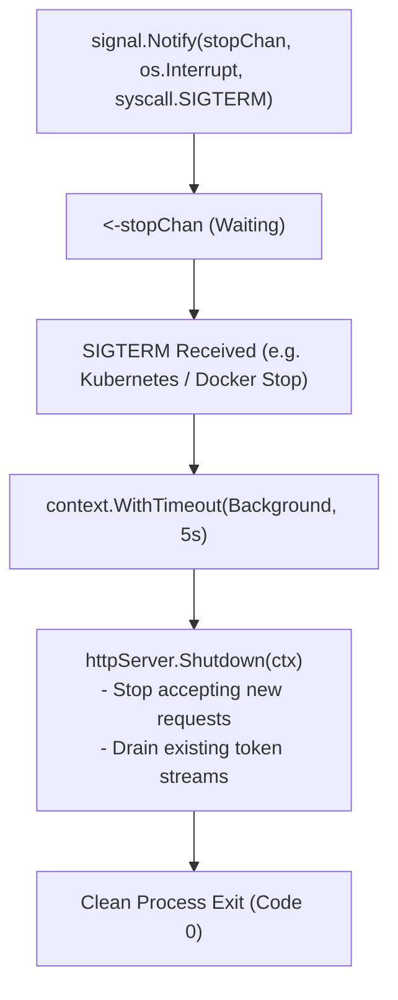
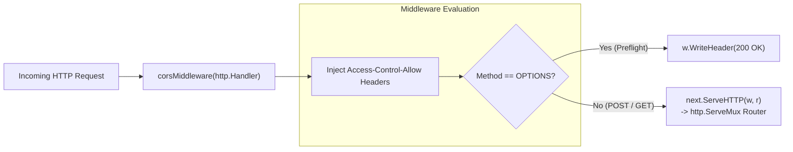

# Top 10 Go Concepts in this Project

This document provides a comprehensive deep-dive into the top 10 Go concepts, idiomatic patterns, and concurrency primitives utilized across the high-concurrency API Gateway in [`go-gateway/`](../go-gateway).

---

## 1. Real-Time HTTP Streaming with `http.Flusher` (Server-Sent Events / SSE)
* **File Reference:** [`go-gateway/main.go:108-113`](../go-gateway/main.go#L108-L113), [`go-gateway/main.go:173-174`](../go-gateway/main.go#L173-L174)
* **Concept:** Type assertion of `http.ResponseWriter` to `http.Flusher` for immediate socket writes.
* **Why it's used:**
  Standard HTTP handlers buffer output in memory before sending the entire response at once. In LLM streaming, tokens must render immediately as they are generated by the GPU.



```go
flusher, ok := w.(http.Flusher)
if !ok {
    http.Error(w, "Streaming unsupported by response writer", http.StatusInternalServerError)
    return
}

// Write chunk and immediately flush to wire:
fmt.Fprintf(w, "data: %s\n\n", chunkBytes)
flusher.Flush()
```

---

## 2. Asynchronous Goroutines and Non-Blocking Server Execution
* **File Reference:** [`go-gateway/main.go:82-89`](../go-gateway/main.go#L82-L89)
* **Concept:** Lightweight, M:N green thread scheduling for concurrent I/O.



---

## 3. High-Performance gRPC Client Streaming with Protobuf Bindings
* **File Reference:** [`go-gateway/main.go:54-64`](../go-gateway/main.go#L54-L64), [`go-gateway/main.go:143-178`](../go-gateway/main.go#L143-L178)



---

## 4. Context Propagation, Timeouts, and Request Cancellation
* **File Reference:** [`go-gateway/main.go:140-142`](../go-gateway/main.go#L140-L142)



---

## 5. Graceful Shutdown with OS Signal Trapping
* **File Reference:** [`go-gateway/main.go:78-98`](../go-gateway/main.go#L78-L98)



```go
stopChan := make(chan os.Signal, 1)
signal.Notify(stopChan, os.Interrupt, syscall.SIGTERM)
<-stopChan

ctx, cancel := context.WithTimeout(context.Background(), 5*time.Second)
defer cancel()
httpServer.Shutdown(ctx)
```

---

## 6. HTTP Middleware Pattern for Cross-Cutting Concerns (CORS)
* **File Reference:** [`go-gateway/main.go:73`](../go-gateway/main.go#L73), [`go-gateway/main.go:215-228`](../go-gateway/main.go#L215-L228)



---

## 7. Configuration via Environment Variables with Fallbacks
* **File Reference:** [`go-gateway/main.go:41-49`](../go-gateway/main.go#L41-L49)

---

## 8. Memory-Efficient JSON Decoding and Streaming Marshalling
* **File Reference:** [`go-gateway/main.go:116-119`](../go-gateway/main.go#L116-L119), [`go-gateway/main.go:171-172`](../go-gateway/main.go#L171-L172)

---

## 9. Idiomatic Error Checking with `errors.Is` and `io.EOF`
* **File Reference:** [`go-gateway/main.go:85`](../go-gateway/main.go#L85), [`go-gateway/main.go:158-166`](../go-gateway/main.go#L158-L166)

```go
for {
    resp, err := stream.Recv()
    if errors.Is(err, io.EOF) {
        break; // Clean completion
    }
    if err != nil {
        log.Printf("Stream interrupted: %v", err)
        break;
    }
    // process token...
}
```

---

## 10. Unbounded Server Write Timeouts for Persistent Long-Lived Streams
* **File Reference:** [`go-gateway/main.go:74-76`](../go-gateway/main.go#L74-L76)
