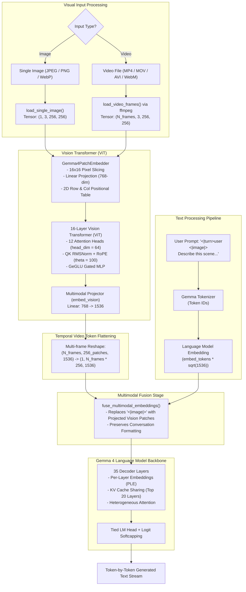
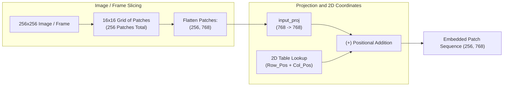

# Gemma 4 Multimodal Architecture: Vision, Video, and Audio Internals

This document details the **multimodal vision, video, and audio pipeline** implemented in pure Rust inside [`src/vision.rs`](../src/vision.rs), [`src/multimodal.rs`](../src/multimodal.rs), and [`src/bin/multimodal_cli.rs`](../src/bin/multimodal_cli.rs).

---

## End-to-End Multimodal Vision and Video Pipeline



---

## 1. Vision Patch Embedder & 2D Spatial Positional Table
* **Code Reference:** [`src/vision.rs:108-169`](../src/vision.rs#L108-L169)
* **Mathematical Operation:**
  1. An image or video frame tensor of shape $(B, 3, H, W)$ is sliced into non-overlapping patches of size $p = 16$.
  2. Each patch of raw pixels ($3 \times 16 \times 16 = 768$ values) is linearly projected onto the 768-dimensional vision embedding space.
  3. A 2D positional embedding vector is derived by indexing into `position_embedding_table` for both row index $y$ and column index $x$:
     $$\text{PosEmbed}(y, x) = \text{Table}[0, y] + \text{Table}[1, x]$$
  4. The 2D positional vector is broadcast-added to the projected patch tokens across all batch/frame dimensions.



---

## 2. 16-Layer Vision Transformer (ViT) Encoder
* **Code Reference:** [`src/vision.rs:241-356`](../src/vision.rs#L241-L356)
* **Architectural Features:**
  - **16 Sequential Transformer Layers:** Each layer features pre-layernorms, post-attention norms, and post-feedforward norms using RMSNorm.
  - **12 Attention Heads:** Head dimension $d_{\text{head}} = 64$ ($12 \times 64 = 768$).
  - **Vision RoPE:** Rotary position embeddings initialized with a base frequency $\theta = 100.0$.
  - **Gated GeGLU MLP:** Intermediate size $3072$ ($4 \times 768$).

---

## 3. Video Frame Temporal Processing
* **Code Reference:** [`src/bin/multimodal_cli.rs:52-88`](../src/bin/multimodal_cli.rs#L52-L88), [`src/multimodal.rs:88-103`](../src/multimodal.rs#L88-L103)
* **Pipeline:**
  1. The CLI accepts video containers (`.mp4`, `.mov`, `.avi`, `.mkv`, `.webm`).
  2. Extracts $N = 8$ uniformly sampled keyframes at $256 \times 256$ resolution.
  3. Encodes all $N$ frames through the ViT encoder $(8, 256, 768)$ and multimodal projection head $(8, 256, 1536)$.
  4. Flattens temporal frames into a continuous visual token stream $(1, 2048, 1536)$ spliced into the `<|image|>` placeholder.

---

## 4. Multimodal Projector (`embed_vision`)
* **Code Reference:** [`src/vision.rs:374-403`](../src/vision.rs#L374-L403)
* **Function:** Linear projection layer mapping the 768-dimensional vision representation into the language model's 1536-dimensional hidden dimension.
  $$h_{\text{multimodal}} = W_{\text{proj}} \cdot h_{\text{vision}}$$

---

## 5. Audio Tower Subsampling Convolutions (`model.audio_tower`)
* **Model Configuration:** [`models/gemma-4-e2b/config.json:5-44`](../models/gemma-4-e2b/config.json#L5-L44)
* **Pipeline:**
  1. Audio spectrogram inputs pass through 2 stages of subsampling convolutions (`128` channels $\to$ `32` channels).
  2. 12-layer audio transformer encoder ($d_{\text{model}} = 1024$).
  3. `embed_audio` linear projection head maps audio tokens into the 1536-dimensional language model embedding space.


---

## 6. How to Run Image & Video Inference

### Running with an Image:
```bash
# On Apple Silicon (Metal FP16):
cargo run --bin multimodal_cli --release -- photo.jpg "Describe the objects in this photo."

# On NVIDIA CUDA:
cargo run --bin multimodal_cli --release --no-default-features --features cuda -- photo.png "Explain the visual scene."
```

### Running with a Video:
```bash
# On Apple Silicon (Metal FP16):
cargo run --bin multimodal_cli --release -- clip.mp4 "Summarize the key events in this video."

# On NVIDIA CUDA:
cargo run --bin multimodal_cli --release --no-default-features --features cuda -- action.mov "What happens throughout this clip?"
```
