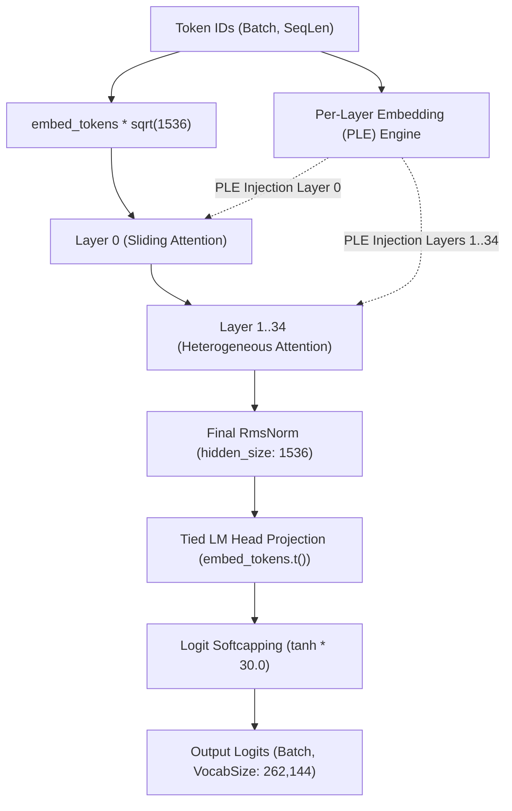
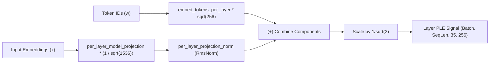
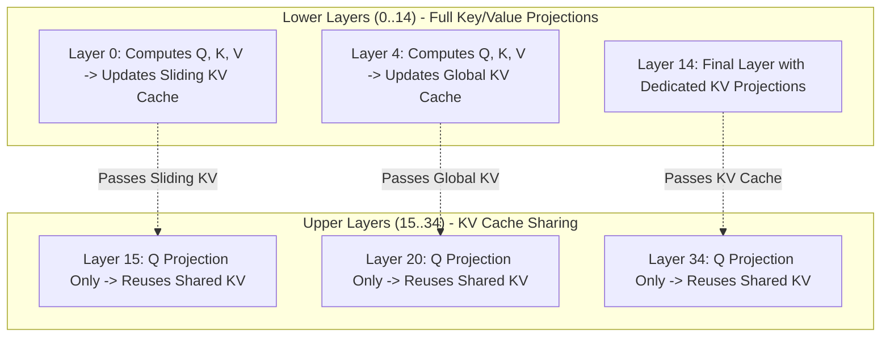
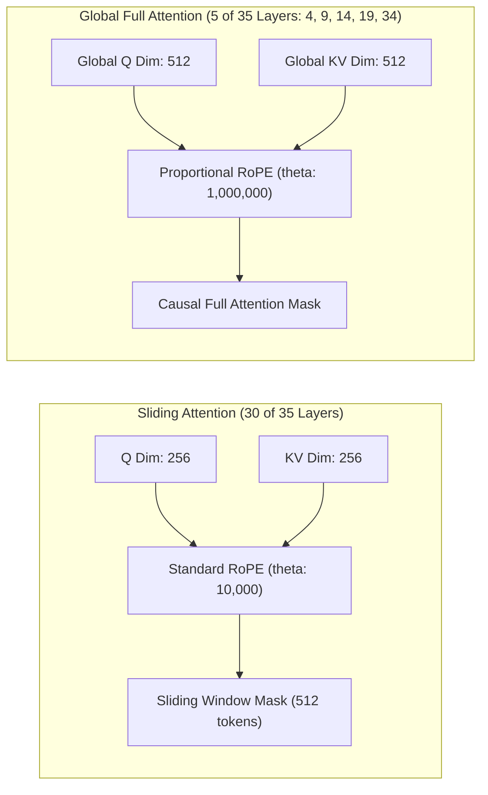
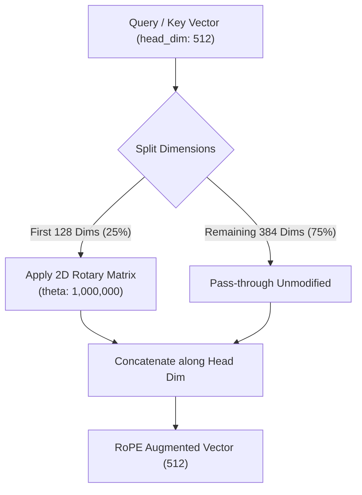
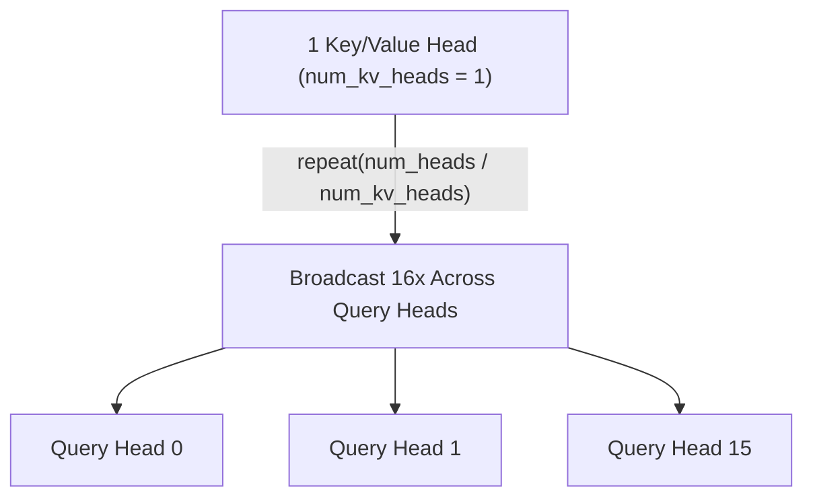
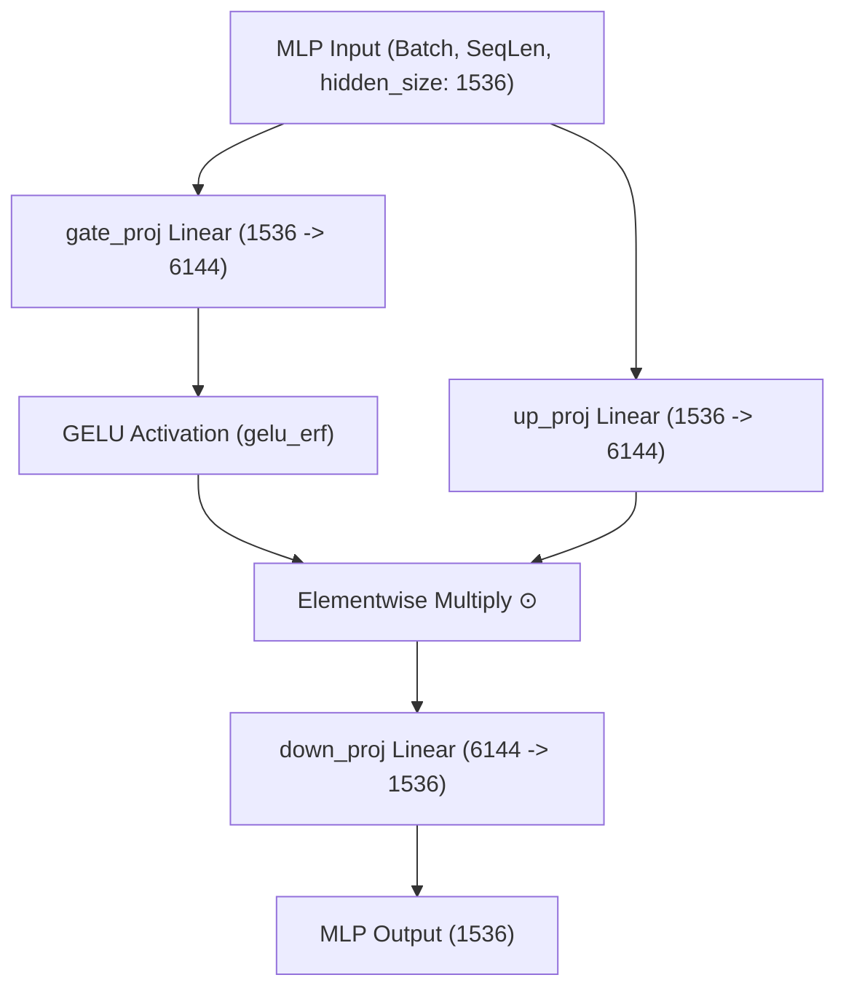
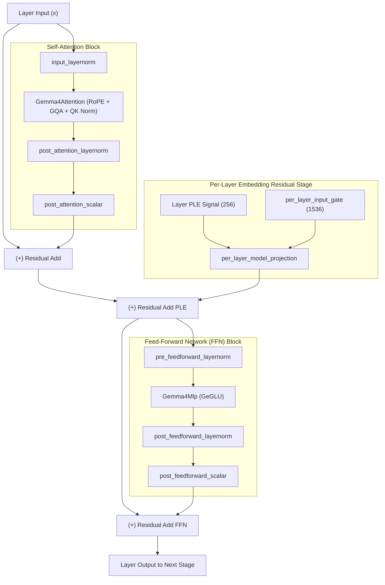
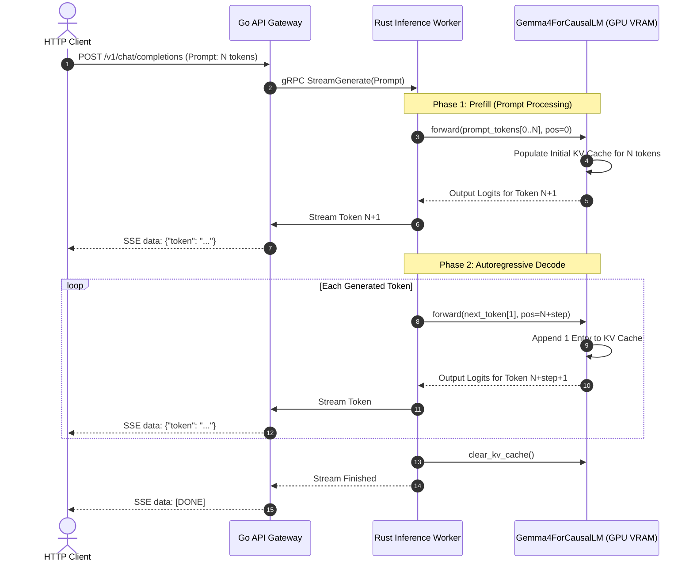

# Deep Learning & Neural Architecture Internals

This document breaks down the top 10 neural architectural mechanics implemented in pure Rust (`src/gemma4.rs`) for Google's Gemma 4 foundation model.

---

## 1. End-to-End Gemma 4 Model Architecture

---

## 2. Per-Layer Embeddings (PLE) Residual Injection
* **File Reference:** [`src/gemma4.rs:583-604`](../src/gemma4.rs#L583-L604), [`src/gemma4.rs:377-384`](../src/gemma4.rs#L377-L384)
* **Mathematical Formulation:**
  Gemma 4 computes a layer-specific identity and context signal:
  $$\text{PLE}_l = \text{Norm}\left(\text{Proj}(x) \cdot \frac{1}{\sqrt{d_{\text{model}}}} + \text{Embed}_{\text{PLE}}(w) \cdot \sqrt{d_{\text{ple}}}\right) \cdot \frac{1}{\sqrt{2}}$$

---

## 3. Upper-Layer KV-Cache Sharing (Layers 15..34)
* **File Reference:** [`src/gemma4.rs:430-438`](../src/gemma4.rs#L430-L438), [`src/gemma4.rs:616-631`](../src/gemma4.rs#L616-L631)
* **Mechanics:**
  In standard transformers, every layer maintains its own Key and Value tensors. In Gemma 4:
  - **Layers 0..14:** Allocate and compute independent Key and Value projections.
  - **Layers 15..34:** Do NOT have `k_proj` or `v_proj` weights. They reuse Key and Value states produced by lower layers.

---

## 4. Heterogeneous Attention (Sliding Window vs Global Full Attention)
* **File Reference:** [`src/gemma4.rs:271-295`](../src/gemma4.rs#L271-L295)

---

## 5. Proportional RoPE (Rotary Position Embeddings)
* **File Reference:** [`src/gemma4.rs:134-192`](../src/gemma4.rs#L134-L192)

---

## 6. Grouped-Query Attention (GQA) & KV Broadcasting
* **File Reference:** [`src/gemma4.rs:326-328`](../src/gemma4.rs#L326-L328)

---

## 7. QK RMS Normalization with Unit Scaling
* **File Reference:** [`src/gemma4.rs:260-264`](../src/gemma4.rs#L260-L264), [`src/gemma4.rs:306-308`](../src/gemma4.rs#L306-L308)

---

## 8. Gated GeGLU Feed-Forward Network (Double-Wide MLP)
* **File Reference:** [`src/gemma4.rs:223-239`](../src/gemma4.rs#L223-L239)

---

## 9. Full Decoder Layer Residual & Scalar Integration
* **File Reference:** [`src/gemma4.rs:356-428`](../src/gemma4.rs#L356-L428)

---

## 10. Prefill vs. Autoregressive Decode Lifecycle
* **File Reference:** [`src/main.rs:163-198`](../src/main.rs#L163-L198)

