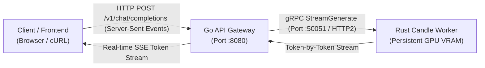

# Gemma 4 Architecture & Systems Guides

Welcome to the documentation suite for the Gemma 4 hybrid Rust + Go inference system.

---

## Guides in this Series

| Guide | Description | Target Areas |
| :--- | :--- | :--- |
| **[Top 10 Rust Concepts](RUST_CONCEPTS.md)** | Deep-dive into systems programming patterns, concurrency, memory-mapping, and asynchronous gRPC pipelines in Rust. | [`src/main.rs`](../src/main.rs), [`src/bin/cli.rs`](../src/bin/cli.rs), [`Cargo.toml`](../Cargo.toml) |
| **[Top 10 Go Concepts](GO_CONCEPTS.md)** | Deep-dive into high-concurrency API gateway patterns, Server-Sent Events (SSE) streaming, context lifecycles, and graceful shutdowns. | [`go-gateway/main.go`](../go-gateway/main.go), [`proto/inference.proto`](../proto/inference.proto) |
| **[Neural Architecture & DL Internals](NEURAL_ARCHITECTURE_INTERNALS.md)** | In-depth breakdown of transformer layers, decoders, Per-Layer Embeddings (PLE), upper-layer KV cache sharing, heterogeneous attention, RoPE, and GeGLU. | [`src/gemma4.rs`](../src/gemma4.rs) |
| **[Multimodal Vision & Audio Architecture](MULTIMODAL_ARCHITECTURE.md)** | End-to-end vision transformer (ViT), 16x16 patch embedder, 2D positional embeddings, multimodal projection, and audio tower subsampling convolutions. | [`src/vision.rs`](../src/vision.rs), [`src/multimodal.rs`](../src/multimodal.rs), [`src/bin/multimodal_cli.rs`](../src/bin/multimodal_cli.rs) |
| **[Google Cloud Platform Deployment Guide](guides/GCP_SETUP.md)** | Step-by-step setup for GCP Compute Engine with NVIDIA L4/A100 GPUs and SkyPilot automation. | [`sky-gcp.yaml`](../sky-gcp.yaml) |
| **[Nebius Cloud Deployment Guide](guides/NEBIUS_SETUP.md)** | Deployment guide for NVIDIA H100 80GB SXM5 instances on Nebius Cloud. | [`sky-nebius.yaml`](../sky-nebius.yaml) |

---

## System Overview

