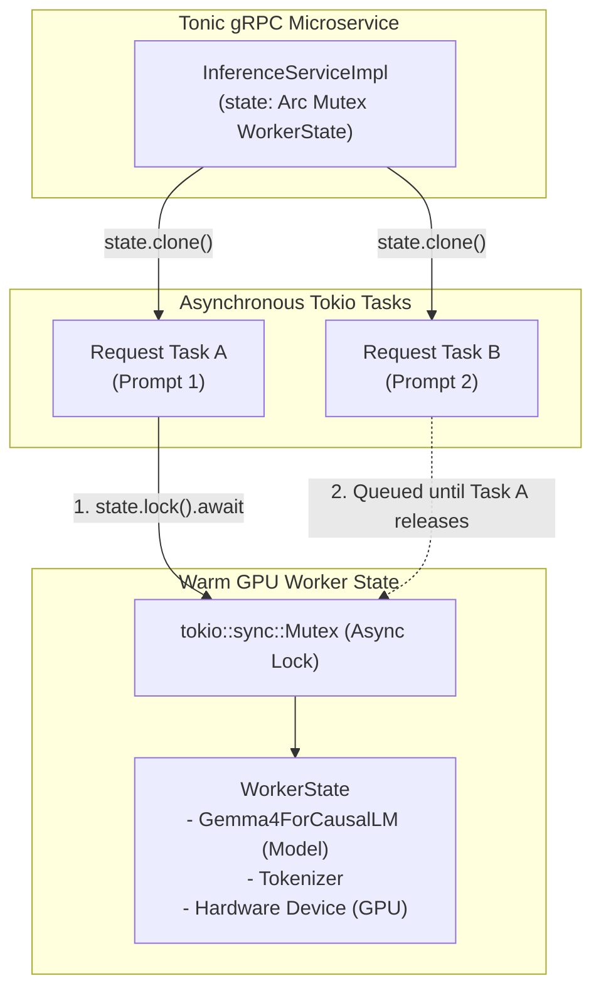
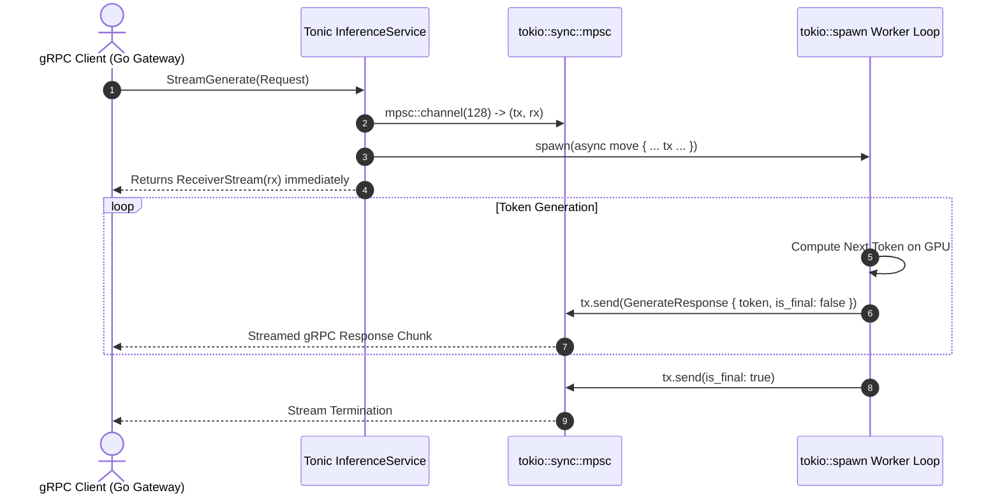
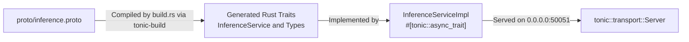
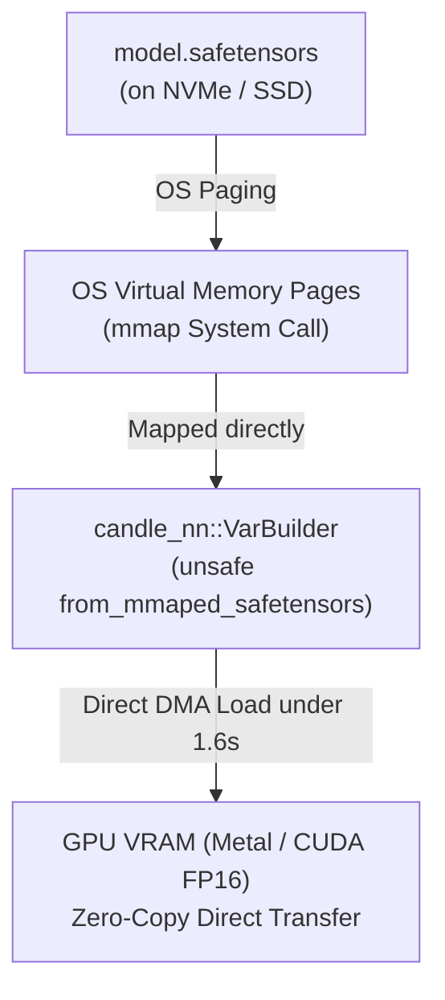
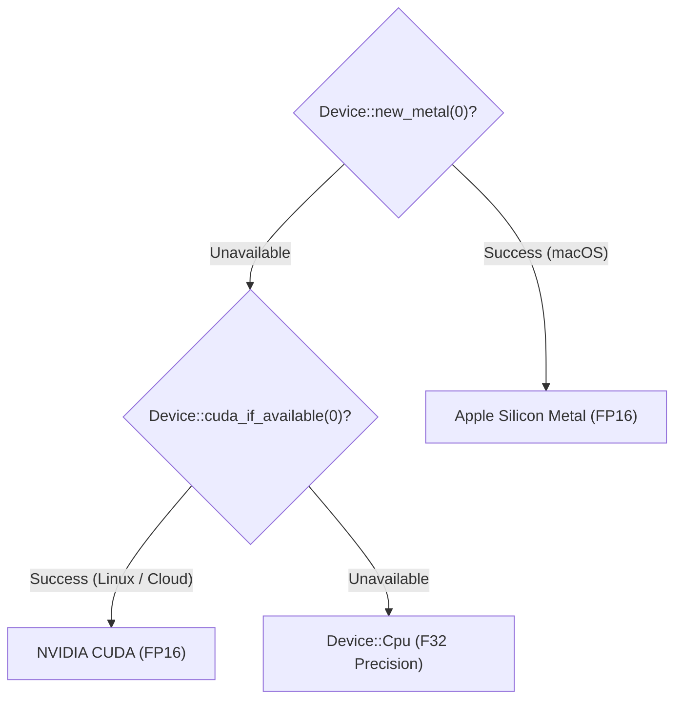
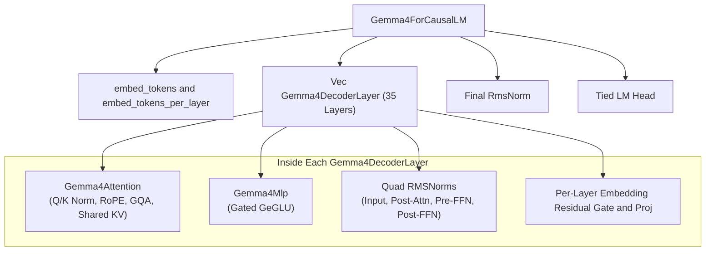
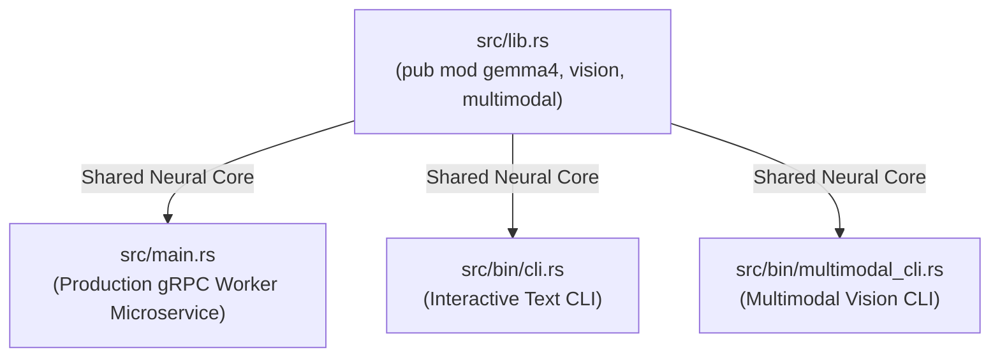

# Top 10 Rust Concepts in this Project

This document provides a comprehensive deep-dive into the top 10 Rust concepts and design patterns utilized across the high-performance Gemma 4 inference engine in [`src/`](../src).

---

## 1. Thread-Safe Shared State with `Arc<Mutex<T>>`
* **File Reference:** [`src/main.rs:45-56`](../src/main.rs#L45-L56)
* **Concept:** Multi-producer, thread-safe interior mutability for GPU worker state.
* **Why it's used:**
  In a persistent gRPC server, multiple asynchronous request tasks can arrive simultaneously. The `WorkerState` encapsulates the warm GPU neural network (`Gemma4ForCausalLM`), the `Tokenizer`, and the hardware `Device`.
* **How it works:**
  - `Arc` (Atomic Reference Counting) provides shared ownership across Tokio tasks.
  - `tokio::sync::Mutex` provides asynchronous mutual exclusion so that while a token generation loop is running, exclusive mutable access (`&mut WorkerState`) is held without blocking the operating system thread.



```rust
pub struct InferenceServiceImpl {
    state: Arc<Mutex<WorkerState>>,
}

// In the gRPC handler:
let state_clone = self.state.clone();
tokio::spawn(async move {
    let mut state = state_clone.lock().await;
    // state.model.forward(...)
});
```

---

## 2. Asynchronous Streaming with Tokio Channels (`mpsc`) and `ReceiverStream`
* **File Reference:** [`src/main.rs:79-80`](../src/main.rs#L79-L80), [`src/main.rs:200`](../src/main.rs#L200)
* **Concept:** Producer-consumer asynchronous pipelines and gRPC response streaming.
* **Why it's used:**
  LLM generation is autoregressive: tokens are produced one-by-one over time. Instead of waiting for full generation to finish (which takes seconds), tokens are streamed instantly as they are computed.



```rust
let (tx, rx) = mpsc::channel(128);
tokio::spawn(async move {
    for step in 0..max_tokens {
        // compute next token...
        if tx.send(Ok(GenerateResponse { token, is_final: false })).await.is_err() {
            break; // Receiver dropped connection
        }
    }
});
Ok(Response::new(ReceiverStream::new(rx)))
```

---

## 3. Tonic gRPC Trait Implementations and Async Traits (`#[tonic::async_trait]`)
* **File Reference:** [`src/main.rs:63-70`](../src/main.rs#L63-L70), [`build.rs`](../build.rs)
* **Concept:** Protocol Buffers code generation and asynchronous RPC service contracts.
* **Why it's used:**
  `proto/inference.proto` defines the contract between the Go API Gateway and the Rust engine.



---

## 4. Zero-Copy Weight Memory-Mapping with `unsafe` and `VarBuilder`
* **File Reference:** [`src/main.rs:239`](../src/main.rs#L239), [`src/bin/cli.rs:73`](../src/bin/cli.rs#L73)
* **Concept:** Zero-copy I/O and fast tensor loading directly into GPU memory.



```rust
let vb = unsafe {
    VarBuilder::from_mmaped_safetensors(&safetensor_files, dtype, &device)?
};
```

---

## 5. Idiomatic Error Propagation with `anyhow::Result` and the `?` Operator
* **File Reference:** [`src/main.rs:28-42`](../src/main.rs#L28-L42), [`src/gemma4.rs:29-31`](../src/gemma4.rs#L29-L31)
* **Concept:** Composable, expressive error handling without unwraps or panics.

```rust
let config_path = model_dir.join("config.json");
let top_config: Gemma4TopConfig = serde_json::from_reader(std::fs::File::open(&config_path)?)?;
```

---

## 6. Zero-Cost Abstractions with Tensor Operations and Functional Pipelines
* **File Reference:** [`src/gemma4.rs:134-145`](../src/gemma4.rs#L134-L145)
* **Concept:** Compiling expressive high-level iterators and tensor expressions into optimal SIMD/GPU kernel invocations.

```rust
let inv_freq: Vec<f32> = (0..dim)
    .step_by(2)
    .map(|i| 1.0f32 / (theta as f32).powf(i as f32 / dim as f32))
    .collect();
let inv_freq = Tensor::new(inv_freq.as_slice(), device)?;
```

---

## 7. Dynamic Hardware Device Dispatch (`Device::Metal` vs `Device::Cuda` vs `Device::Cpu`)
* **File Reference:** [`src/main.rs:223-232`](../src/main.rs#L223-L232), [`src/bin/cli.rs:57-65`](../src/bin/cli.rs#L57-L65)



---

## 8. Conditional Compilation and Cargo Feature Flags
* **File Reference:** [`Cargo.toml:6-10`](../Cargo.toml#L6-L10)
* **Concept:** Compile-time feature selection to link platform-specific native libraries (Metal Shading Language vs NVIDIA NVCC/CUDA).

---

## 9. Modular Hierarchical Struct Composition
* **File Reference:** [`src/gemma4.rs`](../src/gemma4.rs)



---

## 10. Multi-Binary Project Architecture (`src/main.rs`, `src/bin/cli.rs`, `src/bin/multimodal_cli.rs`)
* **File Reference:** [`src/lib.rs`](../src/lib.rs), [`src/main.rs`](../src/main.rs), [`src/bin/cli.rs`](../src/bin/cli.rs), [`src/bin/multimodal_cli.rs`](../src/bin/multimodal_cli.rs)


