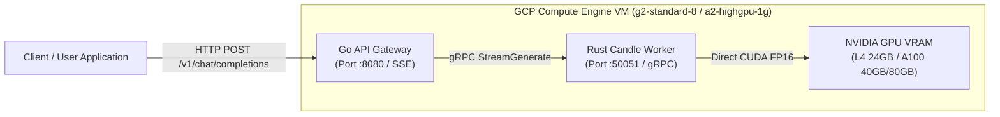

# Google Cloud Platform (GCP) Deployment Guide

This guide details how to deploy the Gemma 4 hybrid Rust inference engine and Go API Gateway on Google Cloud Platform (GCP) using GPU-accelerated Compute Engine instances (NVIDIA L4, A100, or H100) and SkyPilot automation.

---

## 1. Prerequisites and Infrastructure Architecture



---

## 2. Provisioning Compute Engine VM with gcloud CLI

### Option A: NVIDIA L4 GPU (Cost-Effective / High Throughput)
```bash
gcloud compute instances create gemma4-l4 \
    --zone=us-central1-a \
    --machine-type=g2-standard-8 \
    --accelerator=type=nvidia-l4,count=1 \
    --image-family=common-cu121-debian-11-py310 \
    --image-project=deeplearning-platform-release \
    --boot-disk-size=150GB \
    --boot-disk-type=pd-ssd \
    --maintenance-policy=TERMINATE
```

### Option B: NVIDIA A100 GPU (Maximum Bandwidth)
```bash
gcloud compute instances create gemma4-a100 \
    --zone=us-central1-a \
    --machine-type=a2-highgpu-1g \
    --accelerator=type=nvidia-tesla-a100,count=1 \
    --image-family=common-cu121-debian-11-py310 \
    --image-project=deeplearning-platform-release \
    --boot-disk-size=150GB \
    --boot-disk-type=pd-ssd \
    --maintenance-policy=TERMINATE
```

---

## 3. Firewall Configuration

Enable ingress traffic on port `8080` for the Go API Gateway:

```bash
gcloud compute firewall-rules create allow-gemma4-gateway \
    --allow=tcp:8080 \
    --target-tags=gemma4-instance \
    --description="Allow incoming HTTP traffic to Go API Gateway"
```

---

## 4. Environment Setup on the VM

SSH into the provisioned instance:
```bash
gcloud compute ssh gemma4-l4 --zone=us-central1-a
```

### Install Dependencies
```bash
sudo apt-get update
sudo apt-get install -y golang-go protobuf-compiler build-essential pkg-config libssl-dev git

# Install Rust toolchain
curl --proto '=https' --tlsv1.2 -sSf https://sh.rustup.rs | sh -s -- -y
source "$HOME/.cargo/env"
```

### Clone and Configure Repository
```bash
git clone git@github.com:jorgeajimenez/oxidizinggemma.git
cd oxidizinggemma

# Download or place model weights
mkdir -p models/gemma-4-e2b
# Transfer weights using gsutil or huggingface-cli
```

---

## 5. Building and Running Services

### 1. Build Rust CUDA Worker
```bash
export CUDA_HOME="/usr/local/cuda"
export PATH="/usr/local/cuda/bin:$PATH"

cargo build --release --no-default-features --features cuda
cargo build --bin cli --release --no-default-features --features cuda
```

### 2. Build Go API Gateway
```bash
cd go-gateway
go build -o gateway main.go
cd ..
```

### 3. Start Persistent Worker and Gateway
```bash
# Start Rust Worker in background
nohup ./target/release/gemma_hello > worker.log 2>&1 &

# Start Go API Gateway
cd go-gateway
./gateway
```

---

## 6. Automated SkyPilot Deployment to GCP

If you use SkyPilot, you can launch, provision, and serve the cluster with a single command using `sky-gcp.yaml`:

```bash
# Launch instance and start services
sky launch -c gemma4-gcp sky-gcp.yaml --yes

# Check cluster status and public IP
sky status --ip gemma4-gcp

# Stream tokens directly over HTTP SSE
curl -N http://<GCP_PUBLIC_IP>:8080/v1/chat/completions \
  -H "Content-Type: application/json" \
  -d '{"messages": [{"role": "user", "content": "Explain quantum computing in three sentences."}]}'

# Teardown instance when complete
sky down gemma4-gcp --yes
```
