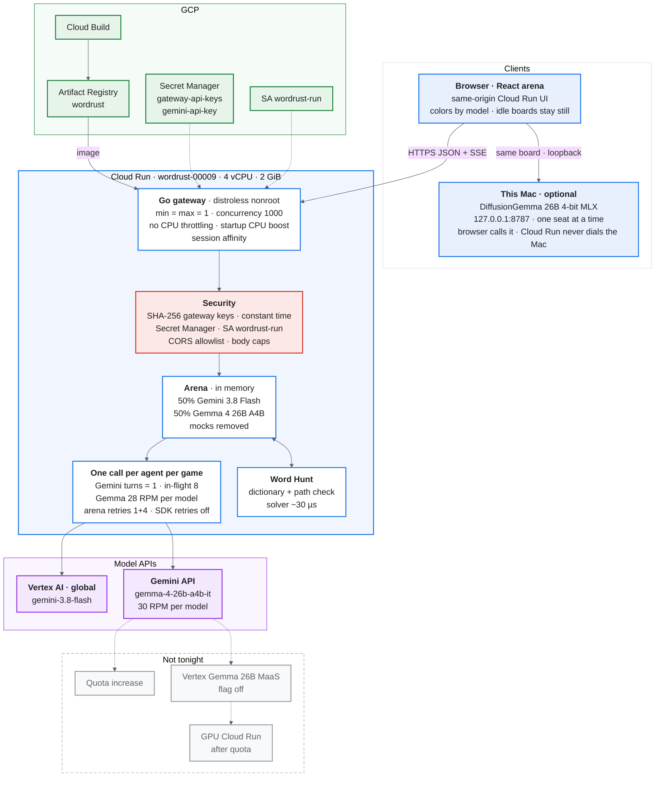

# Word Rust / Word Hunt Arena: architecture

Live: Cloud Run service `wordrust`, revision `wordrust-00009-6fb`, image `6caccf0` (main, including #26). Region `us-central1`. Project `gen-lang-client-0189911611`.

`wordrust-00008-8kr` was the demo revision (image `56fdc3a`, one Gemini turn, colors and the idle-board freeze fix, no #26). #26 is on main and is what `00009` serves: the browser sends the cloud board to the local `:8787` seats.

Diagram: [`architecture.png`](architecture.png).

Blue is the client path. Red is the security boundary. Purple is the model APIs. Green is the rest of GCP. Grey is the scale path that was not turned on.

## What is live

- Two profiles, 50/50: Gemini 3.8 Flash and Gemma 4 26B A4B (`gemma-4-26b-a4b-it`). The mock diffusion and diffusion-JEV profiles, and all `gemma-4-31b-it` traffic, are gone.
- One model call per agent per game. `ARENA_GEMINI_MAX_TURNS=1` (code default is 4). Gemma is already one generate per attempt. The Gemini in-flight cap of 8 is therefore one request per slot.
- Arena retries stay: 1 try plus 4 retries (250 ms, 500 ms, 1 s, 2 s, with jitter; a 429 uses a 2 s base). The genai SDK is not given retry options, and a nil option is a single HTTP attempt, so those arena retries are the only ones.
- Gemma limiter: `ARENA_GEMMA_RPM=28` per model, under the 30 RPM Gemini API cap. Startup CPU boost is on. One instance, 4 vCPU, 2 GiB, concurrency 1000, no CPU throttling, session affinity.
- #23 stops idle boards from repainting (one paint per frame, memoized cards, clock only on running boards). #24 colors cards, tiles, and the leaderboard by model, including teal for the local seat.

## Local DiffusionGemma

`local-model/local_arena.py` binds `127.0.0.1:8787` only. It loads `mlx-community/diffusiongemma-26B-A4B-it-4bit` (about 15 GB on disk, 16 GB+ unified memory) and keeps one generate in flight. The decoder is a fixed 96-token canvas, confidence-threshold sampler at 0.95, and at most 24 denoising steps. The browser probes `/api/health` and, when it is up, posts the cloud board so the local seats play the same tiles. Cloud Run never opens a connection to the Mac. CORS is an allowlist plus `Access-Control-Allow-Private-Network: true`.

## Quota

Each Gemma 4 model on the Gemini API is 30 requests per minute and 16K input tokens per minute on every tier. There is no GPU quota in any region. Vertex managed `gemma-4-26b-a4b-it-maas` is implemented behind `ARENA_GEMMA_VERTEX` and left off. 31B MaaS returns 404.

## Measured

| Run | What happened |
| --- | --- |
| N=24 `e0d74cec94546d50` | Gemini scored 15,200 with 0 errors. Hosted Gemma scored 0 with deadline errors, before minimal thinking. |
| N=100 `f10cc60dcd37dfb6` | 31B mocks 60/60 `429` at the 30 RPM cap. Gemma 26B 13/30 `429`. Gemini 10/10 completed. |
| 8-seat `wordrust-00008-8kr` | One turn. Gemini 2400, 2100, 2000, 2000. Gemma 1200, 800, 500, 400. 0 errors, 0 retries. |
| 8-seat `wordrust-00009-6fb` | Run `eb4eb0bc83121539`. Gemini 12800, 10600, 10600, 8800. Gemma 3300, 3300, 2900, 2900. 0 errors, 0 retries. |

The named Playwright captures (`final-leaderboard.png`, `final-arena-live.png`, `final-arena-boards.png`) were not in the local store. The screenshots in the README are the arena captures that were on disk.

## Security

- `gateway-api-keys` and `gemini-api-key` live in Secret Manager. The gateway stores SHA-256 digests and compares them in constant time.
- Runtime identity is `wordrust-run`, with `aiplatform.user`, `secretmanager.secretAccessor`, `logging.logWriter`, and `monitoring.metricWriter`.
- The image is distroless and runs as nonroot. The local server binds loopback only.
- CORS is an allowlist. The local server also sends Private Network Access headers so the cloud page can call `127.0.0.1`.

## Scale path

Raise the Gemini API quota, or turn on Vertex Gemma 26B MaaS (`ARENA_GEMMA_VERTEX`, cap `ARENA_VERTEX_GEMMA_MAX_INFLIGHT`, default 24) if a like-for-like run shows fewer 429s. GPU Cloud Run waits on GPU quota, which is not granted.
