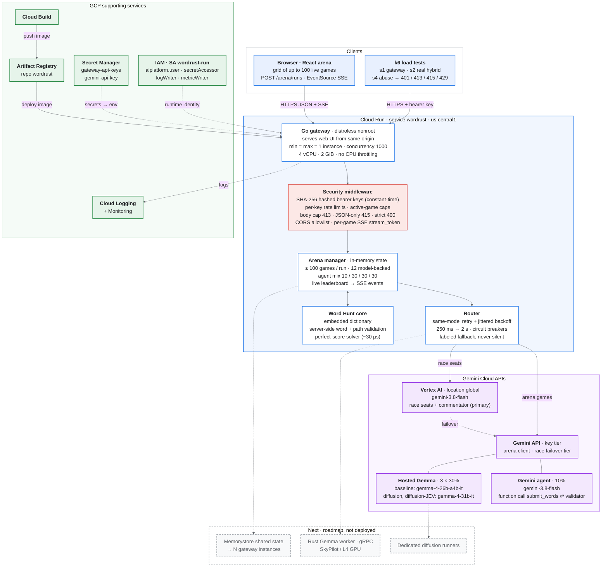

# Word Rust / Word Hunt Arena: architecture

Source: `bourkefloyd/oxidizinggemma` `main` (`Dockerfile`, `hack/gcp.md`, `hack/arena-deploy.md`, `go-gateway/`). Rendered diagram: [`architecture.png`](architecture.png).

**Legend.** Blue: clients and the Cloud Run gateway. Red: the security layer. Purple: Gemini Cloud APIs. Green: GCP supporting services. Solid arrows are live request paths. Dotted arrows are config, identity, or logging paths. Dashed grey boxes are on the roadmap and not deployed.

## One arena run, step by step

1. The browser loads the React UI from the same Cloud Run origin. The Go gateway serves `/app/web`, so there is no separate frontend host or CORS hop.
2. The user starts a run. `POST /arena/runs` sends JSON, and the gateway rejects anything that isn't `application/json` (415), anything over the body cap (413), and unknown fields or trailing data (400).
3. The arena manager draws one board, and the **Word Hunt solver** computes its perfect score server-side (about 30 µs). It creates up to 100 games and backs at most 12 of them with models (`ARENA_MAX_REAL_GAMES=12`).
4. Games are assigned agent profiles in a **10 / 30 / 30 / 30** mix: the Gemini agent (`gemini-3.8-flash`), then three hosted Gemma profiles: baseline on `gemma-4-26b-a4b-it`, and diffusion and diffusion-JEV on `gemma-4-31b-it`.
5. The **Gemini agent** uses function calling. The model calls `submit_words`, the server validates each word against the dictionary and the board path, and the model iterates on that feedback.
6. Each model call goes through the router. It retries the **same model** with jittered backoff (250 ms, 500 ms, 1 s, 2 s) until the round deadline. Failures are labeled in results and never silently substituted.
7. Scores come only from server-side validation, never from model output. The leaderboard and per-game progress stream to the browser over **SSE** (`GET …/events`, `retry: 1000`).
8. Logs go to Cloud Logging under the `wordrust-run` identity.

## Security and reliability

- Bearer keys come from Secret Manager (`gateway-api-keys`). The gateway stores only SHA-256 digests and compares them in constant time. Games are scoped to their key, and other keys get 404.
- Per-key token-bucket rate limits apply to create, word, and read routes, alongside per-key and global active-game caps.
- Strict input handling: body size cap, JSON-only content type, strict JSON decoding, and a CORS allowlist. Backend errors are never echoed to clients. Word injection, forged paths, duplicates, and late words are all rejected.
- Browser `EventSource` can't send auth headers, so SSE uses a per-game `stream_token` instead.
- The image is distroless and runs as `nonroot`. The `wordrust-run` service account has only four roles: `aiplatform.user`, `secretAccessor`, `logWriter`, and `metricWriter`. The Gemini key lives in Secret Manager (`gemini-api-key`), not in the image.
- Reliability: same-model retry with backoff, circuit breakers per tier, and Vertex → Gemini API key failover for race seats. A failed player still lets its game finish. These paths are covered by `go test -race` tests.

## Scale and architecture

- The deployment is deliberately a **single instance** (`min=max=1`, concurrency 1000, 4 vCPU, 2 GiB, no CPU throttling, session affinity). Arena state is in memory, so a second instance would break runs.
- The Go gateway is cheap per stream: goroutines handle each SSE stream. Model concurrency is bounded (12 model-backed games per run), and solver and validation are microsecond-scale.
- k6 scenarios: `s1` gateway throughput, `s2` real-model hybrid, and `s4` abuse, which checks for 401, 413, 415, and 429.
- **Next:** move state to Memorystore (or route deterministically by `run_id`) to run N instances; add a Rust Gemma gRPC worker on an L4 GPU via SkyPilot or Cloud Run GPU; add dedicated diffusion runners.
